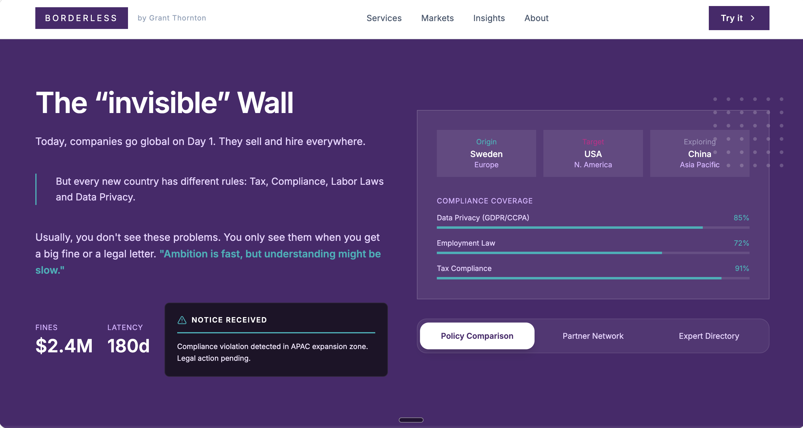
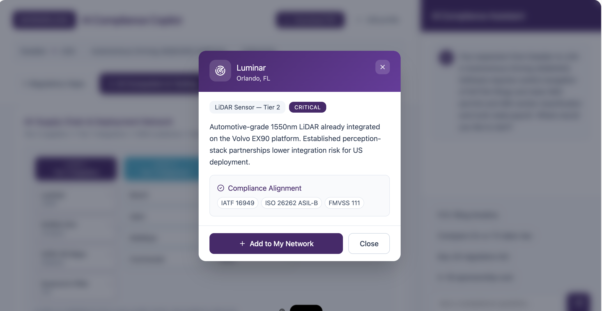
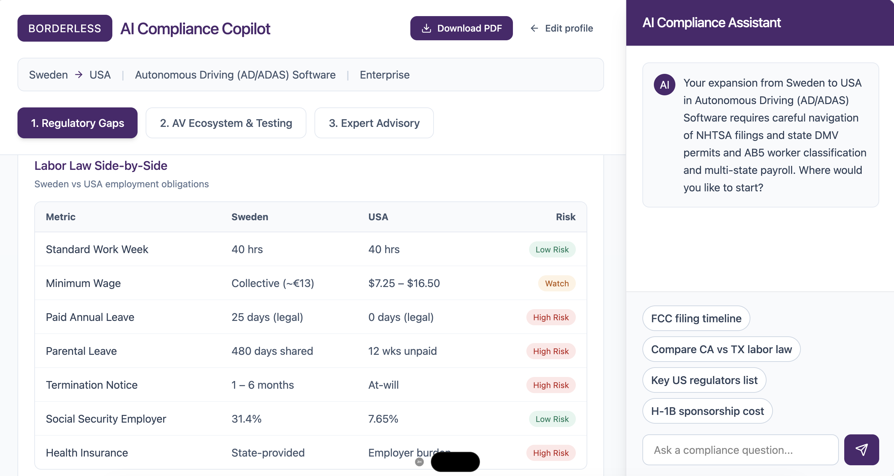

# Zero Error: AI Compliance Dashboard

A modern, high-performance web application designed for comprehensive AI policy compliance, partner networking, and ecosystem visualization.

## 🚀 Overview

The **Zero Error** project offers an interactive, premium-designed dashboard and landing page system. It provides tools for exploring compliance standards, managing expert directories, and visualizing complex data networks. This UI was originally inspired by an [AI Compliance Dashboard Design on Figma](https://www.figma.com/design/Ng7A1f2GFq2xRjhHC3ZPKC/AI-Compliance-Dashboard-Design).

## 📸 Screenshots

*(Add your screenshots to the `public/screenshots/` folder to display them here)*

<div align="center">
  
  <br/>
  <em>Main Landing Page</em>
</div>

<p align="center">
  
  &nbsp;
  
</p>

## ✨ Key Features

- **Policy Comparison**: Quickly review and compare AI policies and compliance metrics.
- **Partner Network Ecosystem**: Interactive diagrams (`EcosystemGraph.tsx`) displaying relationships between different partners.
- **Expert Directory**: A robust hub to explore and identify domain experts.
- **Data Visualizations**: Includes an interactive US Map (`USMap.tsx`) and Data Charts (`TalentHubChart.tsx`) powered by Recharts.
- **Interactive Chat Assistant**: A seamless chat sidebar for quick queries (`ChatSidebar.tsx`).
- **Premium UI/UX**: Built with modern aesthetics, vibrant colors, glassmorphism, dynamic micro-animations, and segment tabs.

## 🛠️ Technology Stack

- **Framework**: [React 18](https://react.dev/) + [Vite](https://vitejs.dev/)
- **Styling**: [Tailwind CSS v4](https://tailwindcss.com/)
- **UI Components**:
  - [Radix UI](https://www.radix-ui.com/) (Accessible, unstyled components)
  - [Material UI (MUI)](https://mui.com/)
  - [Framer Motion](https://www.framer.com/motion/) (Fluid animations)
- **Data Visualization**: [Recharts](https://recharts.org/)
- **Routing**: React Router v7

## 📦 Getting Started

### Prerequisites

Make sure you have [Node.js](https://nodejs.org/) installed (version 18+ recommended).

### Installation

1. Clone or download the code bundle.
2. Navigate to the project directory:
   ```bash
   cd zero_error
   ```
3. Install the required dependencies:
   ```bash
   npm install
   ```

### Development Server

To run the application locally:
```bash
npm run dev
```
Open `http://localhost:5173` (or the address provided in your terminal) in your browser to interact with the app.

### Build for Production

To create an optimized production build:
```bash
npm run build
```

## 🤝 Team / Credits

*Zero Error Buildathon / Hackathon Project*
This project was built to deliver a highly interactive and visually stunning user experience, featuring team introductions, professional networking hubs, and analytical data views.